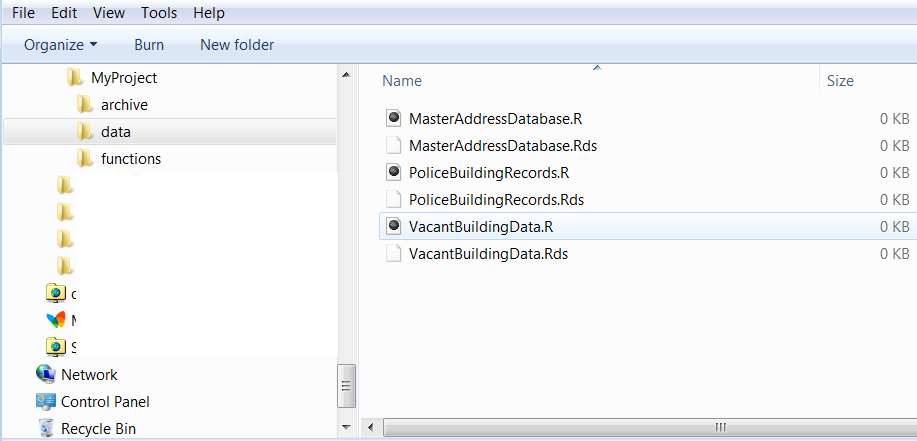

DATA SCIENCE FOR BUSINESS PRGM - 2014-2015 Autumn
================================================================================
width: 1920
height: 1080

Author: Gene Leynes

Date: September 11, 2014


How to learn R
================================================================================

There are many guides like it, but this one is mine...
(not) Full Metal Jacket

Which guide is best depends on your leanring preferences, your background, your ambitions.  It's often good to use resources that are outside of your field of expertise, and it's good to revisit things that don't make sense at the time (or that do make sense).

In all cases, I highly recommend that you use R Studio to edit your code / manage projects. http://www.rstudio.com/

Advice on learning / getting help:
 - Always default to using the main R website: http://www.r-project.org/
 - This is not the most user friendly website, documentation, or list of resources, however it's always the main source of all things R.  The R program is also the most reliable part of R; sometimes packages don't work, IDEs change, things happen... but R itself (often called "base R") is extremely stable.
 - The R FAQs are invaluable: http://cran.r-project.org/faqs.html
 - The documentation is also invaluable: http://cran.r-project.org/manuals.html
 - You can access the help right from R, e.g. type "?lm" at the console.  The built in help is your number one resource.
 - The help can be very hard to understand.  My main advice is don't think too hard, sometimes it takes years for a topic to make sense to me.
 - Download and print more than one copy of this cheat sheet: http://cran.r-project.org/doc/contrib/Short-refcard.pdf  (maybe even laminate one)
 - See also http://cran.r-project.org/doc/contrib/Baggott-refcard-v2.pdf (this one is new to me)


How to learn R (cont)
================================================================================

 - Pay attention to when something was written, and (if you can) to the author
 - Early R contributors really understand the internals, but their writings can be hard to understand.
 - Newer R contributes often approach things from the perspective of their particular angle / set of packages 
 - You can search / view previous questions asked on r-help or Stack Overflow
 - If you get stuck and must ask the community for help, I highly recommend Stack Overflow over the r-help mailing list. http://stackoverflow.com/questions/tagged/R
 - Resources related to specific packages:
 - The best data.table resource is the FAQ: http://cran.r-project.org/web/packages/data.table/vignettes/datatable-faq.pdf
 - ggplot2 is important (although Hadley says that he's moved on to other things)
 - http://ggplot2.org/
 - http://www.cookbook-r.com/Graphs/ (main link below)

How to learn R (cont)
================================================================================

My favorite learning R resources:
 - http://www.cookbook-r.com/
 - http://www.r-statistics.com/

If you have experienced a singularity and have near infinite time to think:
 - http://www.r-bloggers.com/
 - http://cran.r-project.org/doc/contrib/
 - http://cran.r-project.org/doc/contrib/usingR.pdf
 - http://cran.r-project.org/web/views/


Big picture details of R
================================================================================
Things on your computer
 - R (command line)
 - R GUI
 - R Studio

Things in R
 - Elements
 - Types
 - Vectors
 - Lists
 - Environments

Things in R that do things (mostly within R)
 - Scripts
 - Projects
 - Packages on CRAN (install.packages)
 - Packages elsewhere (devtools)


Ground rules
================================================================================
You don't need to declare anything.
You do need to import libraries.
There are different ways to use R
 - Step through code
 - Run a script at the command line
 - Put things into functions (more like making software)


Anatomy of a typical script
================================================================================

```r
##------------------------------------------------------------------------------
## INITIALIZATION
##------------------------------------------------------------------------------
rm(list=ls())
gc()
library(geneorama)
detach_nonstandard_packages()
library(geneorama)
loadinstall_libraries(c("geneorama", "data.table", "reshape2", "Matrix"))

sourceDir("functions/")
op <- readRDS("data/op.Rds")  ## Default par
par(op)

##------------------------------------------------------------------------------
## Load data for vacant buildings and violations
##------------------------------------------------------------------------------
datBuild <- readRDS("data/20140507/Building_Violations.Rds")
VIOLATION_ORDINANCE <- readRDS(
	"data/20140507/Building_Violations__VIOLATION_ORDINANCE.Rds")
VIOLATION_ORDINANCE_DM <- readRDS(
	"data/20140507/Building_Violations__VIOLATION_ORDINANCE_dummy_matrix.Rds")
## Convert Names
setnames(datBuild, 
		 old = colnames(datBuild), 
		 new = gsub("\\.", "_", colnames(datBuild)))
```

Typical Project
================================================================================
## Project structure------------------------------------- Data Structure-------------------------------
  


================================================================================
# One Example


```r
## Boxplot Example with gl
g = factor(round(10*runif(10*100)))
x = rnorm(10*100)+sqrt(as.numeric(g))
xg = split(x,g)
boxplot(xg, col='lavender', notch=T, var.width=T)
```


================================================================================
# Tsay Time Series book cover


```r
# Make two plots on the same canvas # Legend # Random walk  # Tsay book cover
set.seed(123456);par(mar=rep(5,4))
e <- rnorm(500)## White noise
randwalk <- cumsum(e)## Random walk
trend <- 1:500## Trend
plot.ts(0.5 * trend + e, lty=1, ylab='', xlab='')## deterministic trend + noise
lines(0.5 * trend + cumsum(e), lty=2)## random walk with drift
lines(randwalk, lty=3, col='red')## random walk (same scale)
par(new=T)
plot.ts(randwalk, lty=3, axes=FALSE, col='red')## random walk (own scale)
axis(4, pretty(range(randwalk)))
legend(10, 18.7, legend=c('deterministic trend + noise (left)',
						  'random walk w/ drift (left)', 'random walk (left+right)'),
	   lty=c(1, 2, 3), col=c('black', 'black', 'red')) 
```


